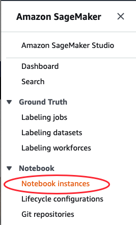
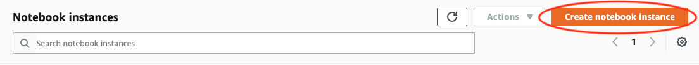
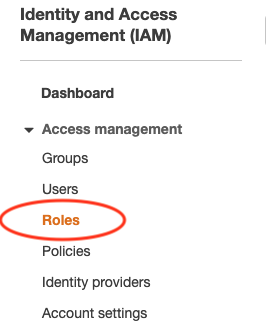
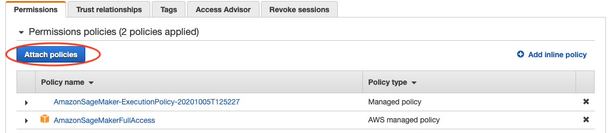

# Athena Sagemaker Workshop
The objective of this lab is to get you started with learning how to build a machine learning model using Sagemaker. You will learn:

- How to load a dataset using Amazon Athena
- Perform some data exploration within a notebook
- Train, deploy and evaluate a machine learning model using Amazon SageMaker

In this workshop, we will be building a machine learning model using the NYC taxi dataset to predict the taxi amount base on select fields such as trip duration, distance and time. We will be using Amazon Athena to load and explore our dataset and Amazon Sagemaker to train, deploy and evaluate our machine learning model. To get started, please follow the instructions below.

---

## Environment Setup

For this workshop, we will be using an Amazon Sagemaker notebook instance (https://docs.aws.amazon.com/sagemaker/latest/dg/nbi.html) run our notebook. 

In this setup, you will learn how to:

- Create a Sagemaker Notebook instance
- Setup the necessary IAM permissions for your SageMaker notebook

---

### Create Sagemaker Notebook Instance

1. In the Amazon Console, go to `Amazon Sagemaker`
2. Select `Notebook instances` in the left menu
   
    
1. Click `Create notebook instance`. Here we will be creating a new notebook instance to load out notebook.

4. In the Create notebook instance screen, fill in the following details.
   
   - Notebook instance name (i.e. sagemaker-athena-workshop).
   - Notebook instance type: ml.t2.medium
        
   - IAM role: Create an IAM role
     - For this workshop, leave the defaults and click `Create role`. **Important:** Take note of the IAM role name.
    
    
   - Under Git repository -> Default repository, select `Clone a public Git repository to this notebook instance only`
   - Under Git repository URL use: https://github.com/dalacan/aws-sagemaker-athena
    

5. Click `Create notebook instance`. It should take about 5 minutes for your notebook to be ready.

---

### Setup IAM role Permissions
By default, the IAM role we created for the Sagemaker instance will only have the necessary permissions to access Sagamker services. However, as we will also be using Amazon Athena for this lab, we will need to grant it permission for Amazon Athena. 
   
To setup this up,
1.  Go back to your AWS console, click `Services` and go to `IAM` (Identity and Access Management).
2.  Select `Roles` in the left menu
    
    
3.  Find the sagemaker execution role (it should look lke this `AmazonSageMaker-ExecutionRole-XXXXXXXXXXXXXXX`) and select it
4.  Click `Attach policies`
   
    
5.  Look for `AmazonAthenaFullAccess`, select the checkbox and click `Attach policy`.
   
    

Your SageMaker exeuction role will now have access to Amazon Athena which means that notebooks within your SageMaker notebook instance using the Amazon API will be able to access Amazon Athena.

---
## Lab

Now that we have setup our environment, let us begin with the lab. To get started, in the console, go to `Amazon SageMaker -> Notebook instances`. In the Notebook instances list, you will see the name of the notebook that you've created. If it's status is `InService`, you're ready to begin and click `Open JupyterLab` to begin. If not wait for the status to change to `InService`.

In the notebook, launch the notebook `nyc-taxi-athena.ipynb` and follow the instructions.

